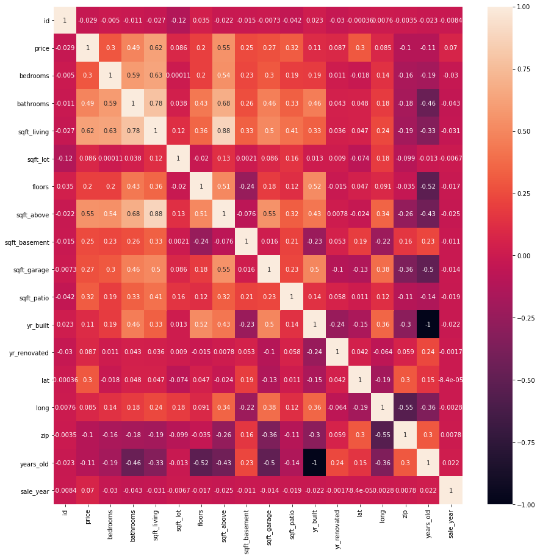
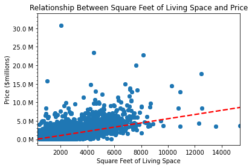
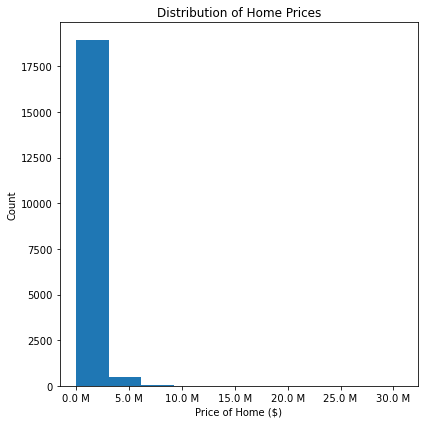
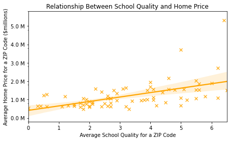
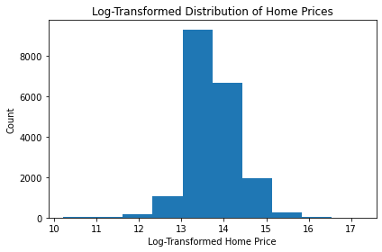
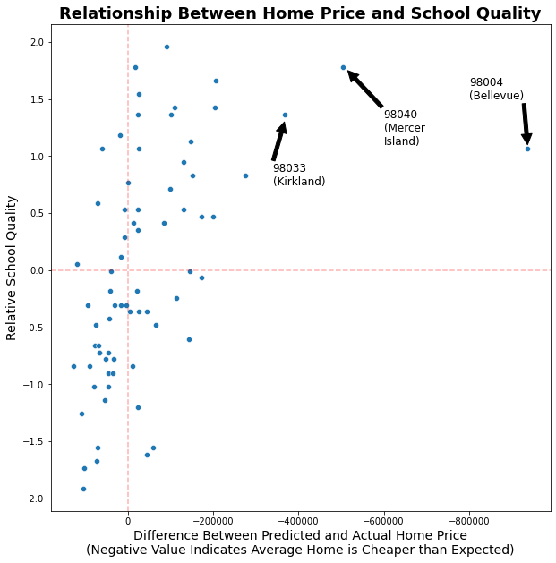
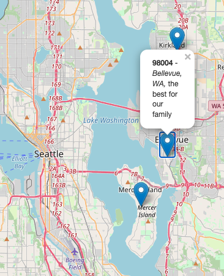

# Recommending ZIP Codes to a Family Moving to King County, WA

## Overview

Tasked with creating a predictive model for home prices in King County, Washington, we elected to focus our model on predicting prices with the goal of helping families that earn roughly the median income for a household in Seattle (~$100,000 per year) buy a home that is in their price range and in an area with good schools. 

We used housing sale data from the King County House Sales dataset, student test score data from Washington State's open data portal, and school address information from the Washington school directory to build our model. We tried a variety of approaches in building our model, including log transformations, RFE, and others. Using the strongest of these (r-squared of .71) we created predicted home sale prices for the dataset and compared those predictions to actual sale prices to determine in which zip codes homes are selling for less than we expect, and in which zip codes schools are better than average. 

Based on these factors, we recommend that families look to purchase housing in the 98004 zip code, which is in Bellevue, WA (10 minutes outside of Seattle by car).

## Business Problem

The Agrawal-Gerber Realty Firm assists families moving to King County, Washington in finding a market-rate home in an area with good schools for their kids. To inform our recommendations, we have created a model to predict the price of homes in King County (which comprises Seattle, Bellevue, Kent, and several other small- to mid-sized cities and towns). 

Housing in King County is very expensive (the median home in the dataset of sales county sold for $860,000), so families need to know that their investment represents a good value before they commit to buying a home.

By measuring our predictions against records of actual home sales from 2021 to 2022, we can recommend areas where we believe homes are selling for less than their true value - thus providing families with the ability to buy a home at a good price before the housing market catches up.

## Data Understanding

We used information from three datasets to build our model, all of which are saved in the data folder of our repository:
- Housing sale data from the [King County House Sales dataset](data/kc_house_data.csv), which includes the target variable for our models (price) and a wide range of continuous, discrete, and categorical predictor variables, such as zip code, square feet of living space, number of bedrooms, and more.
- Student test score data from [Washington State's open data portal](https://data.wa.gov/education/Report-Card-Assessment-Data-2021-22-School-Year/v928-8kke), which we used to build a composite measure of average school quality by zip code to use as a predictor for our model.
- School address information from the [Washington school directory](https://eds.ospi.k12.wa.us/directoryeds.aspx) to build our model, which we used to match schools to zip codes in the King County House Sales dataset.

We began with some exploratory data analysis which revealed a relationship between square feet of living space and price:

It also revealed that the price of homes in the county has a significant right skew that we would need to account for in later modeling.

We used a single variable - square feet of living space - to construct our baseline model and iterated from there. We performed only cursory data cleaning before running our baseline; for example, we located and removed a record of a home that was incorrectly listed as being only 3 sq. ft. large, and we removed records for homes that were not located in King County by extracting ZIP code from the home address and matching it to a list maintained by the county.

## Modeling and Regression Results
### Model 1: Baseline model

We split our data into train and test sets and used the train set to iterate on our model.

The baseline model with train data had an adjusted r-squared of .393, and a mean absolute error of over $270,000. From there, we decided to process our data to incorporate more predictor variables and include the accuracy of our model.

### Data cleaning and processing

Because our clients are interested in school quality, we used data from Washington State's open data portal to develop a composite ZIP-code-level school quality rating using student test scores on standardized tests. We matched schools to ZIP codes using data from the Washington school directory. Then, we demonstrated that there is a simple relationship between average school quality for a ZIP code and average home price for a ZIP code using a scatterplot.

Having created and validated this metric, we moved on to processing our categorical variables. We created an ordinal scale for variables such as "view", "condition", and "grade"; created a boolean column to differentiate homes that had been renovated vs. homes that had not by using the values in the 'yr_renovated' column; and created dummy variables for nominal variables such as waterfront, greenbelt, and nuisance so that we could see the impact they have on home price. We also dropped unnecessary columns from our data.

### Model 2: All Variable Model
When we ran our "all variable model" on our train data, we found that this model performed substantially better. The model is statistically significant, and our adjusted r-squared increased from 39% to 53.8%, which indicates that the model explains the variance in price about 15 percentage points better than the simple model did. But we recognized that there was still significant room for improvement.

### Transforming variables
We saw that some of our predictor variables (such as square feet of living space, square feet of space above ground, and years old) and our outcome variable had a rightward skew so we used a log transformation to normalize their distribution. You can see that compared to the distribution above, this data appears to have a more normal distribution.

We used these transformed variables, as well as the other non-transformed variables from our All Variable Model, to run our third model.

### Model 3: Log-transformed Model
This model didn't change much from the all-variable model. The model is still statistically significant, but our adjusted r-squared barely changed (.538 to .541) - suggesting that this model does not explain more variance in our outcome than did the previous model.

However, there is still one major place for improvements - we need to treat ZIP codes as the categorical variable they are, and not as a continuous numeric variable.

### 'Final' Model: One-Hot Encoded Zip Codes
Up to this point our model was treating ZIP codes as a numerical variable, but in reality they are a categorical variable. We needed to one-hot encode them to include them properly in our model.

We created dummy variables for each ZIP code, with 98021 as our reference.

Our model showed a significant jump in performance as a result of this change, reaching an adjusted r-squared of .707 on our train data.

### Validating the final model against test data
We tested our final model against previously unused test data by transforming that data using the same steps as we used in transforming our previous models, and got an adjusted r-squared of .687. This value was close enough to that for our train data that we felt comfortable moving forward with our analysis.

## Answering Our Business Question
After validating our model, we ran the full dataset through it to predict the value of each listing and compare it to the observed sale price to calculate our residuals. Our goal was to find a ZIP code where the average difference between the residual values were negative on average, which would indicate that our model thinks those homes sold for less than they "should" have. We also added information on school quality for each ZIP code to this dataset and standardized it so that we could determine which ZIP codes have homes that are a good value and have above average schools.

Based on this analysis, we recommend that families begin their home search in one of three ZIP codes: 98004 (Bellevue), 98040 (Mercer Island), and 98033 (Kirkland).

## Conclusions
Ultimately, we recommend that families begin their home search in one of three ZIP codes: 98004 (Bellevue), 98040 (Mercer Island), and 98033 (Kirkland). These areas have homes that our model suggests are undervalued (meaning they are a good investment), and have schools that are above average in terms of student performance on state tests.

Some limitations of our model: 
- We achieved an r-squared of around .7, but that still means that roughly 30% of the variation in price cannot be explained by our model.
- The model has some issues with multicollinearity and satisfying the other assumptions of linear regression.
- We don't have any information on housing types (i.e. single family vs. multifamily, standalone vs. condo, etc.) that may be important predictors of home value in our model.

In the future, we could improve and expand this model by:
- Incorporating additional data on school quality.
- Gathering more data from past home sales and future home sales to increase the size of our dataset and examine sales trends over time.
- Finding additional predictor variables such as home type and incorporating them into our model.

## Links to Materials
[Presentation](KingCounty_Slides.pdf)  
[Jupyter Notebook](King_County_Analysis_Notebook.ipynb)